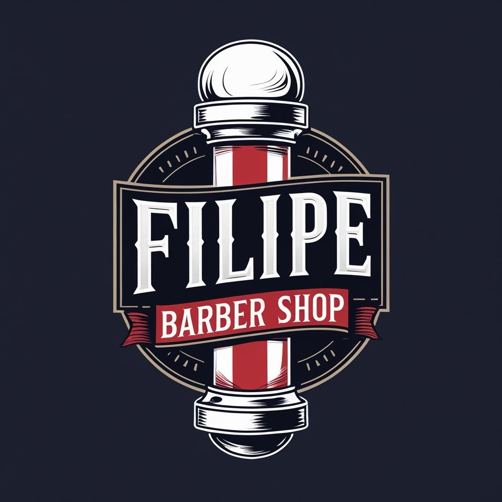

# filipe-barbershop-
<!DOCTYPE html>
<html lang="pt-BR">
<head>
  <meta charset="UTF-8" />
  <title>Filipe Barber Shop</title>
  <link href="https://fonts.googleapis.com/css2?family=Poppins:wght@400;600&display=swap" rel="stylesheet" />
  
</head>
<body>

  <header>
    
    <h1>Filipe Barber Shop</h1>
    
Agende seu horário com estilo!

  </header>

  

    <h2>📅 Agendar Horário</h2>
    <form id="formAgendamento">
      <input type="text" id="nome" placeholder="Seu nome" required />
      <input type="date" id="data" required />
      <input type="time" id="hora" required />
      <button type="submit">Confirmar Agendamento</button>
    </form>
  

  

    <h2>🗓️ Agendamentos Salvos</h2>
    

  

  <footer>
    📞 WhatsApp: <a href="https://wa.me/5579981254335" class="whatsapp-link" target="_blank">Falar com o Filipe</a>  
    © 2025 Filipe Barber Shop
  </footer>

  
</body>
</html>

